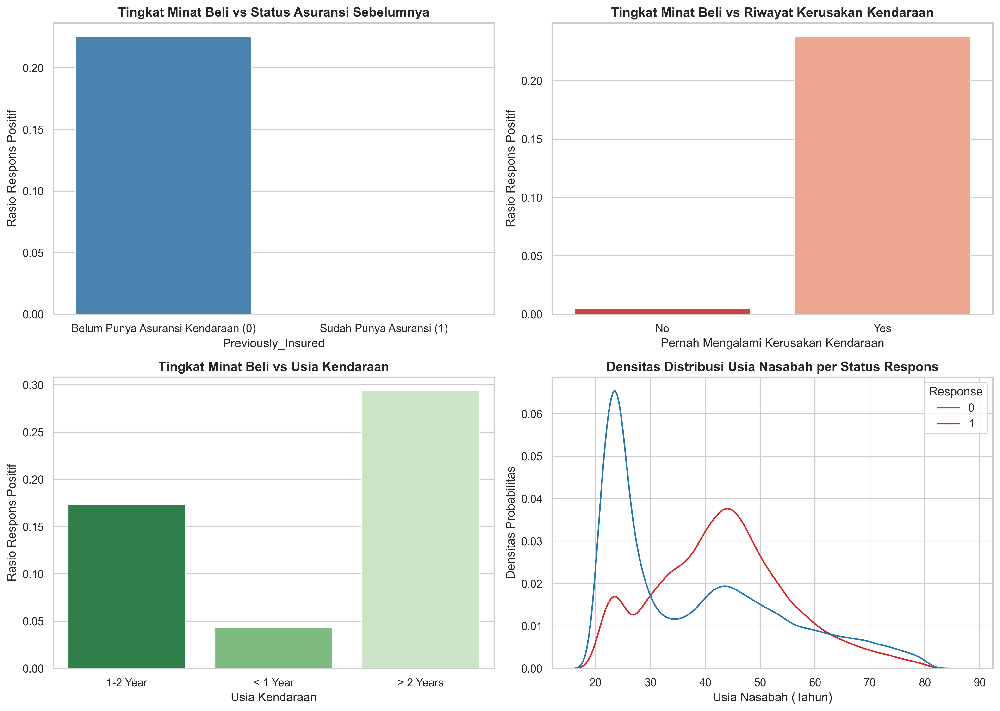
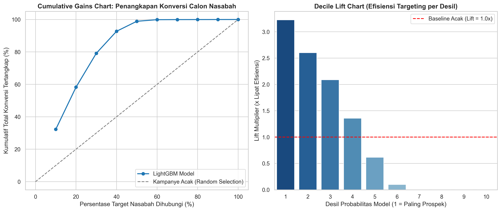
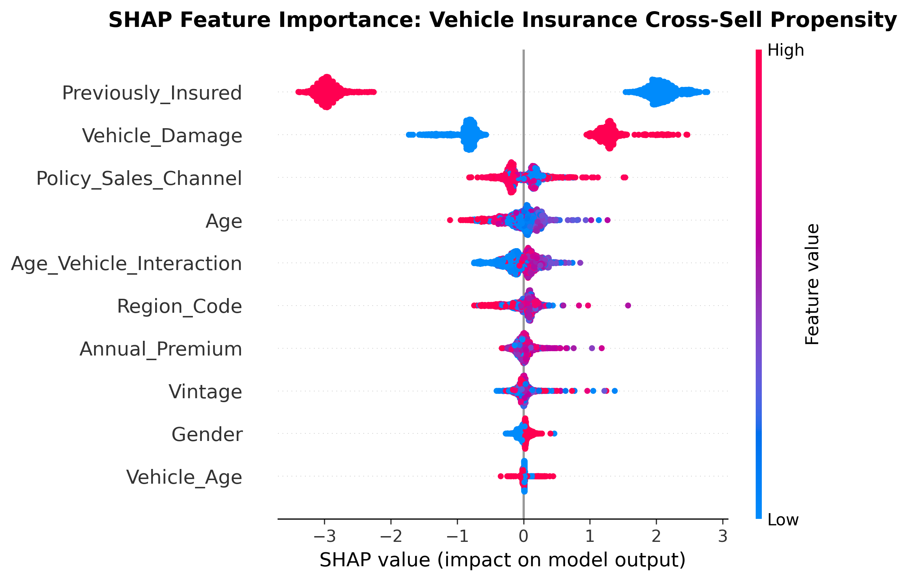

# Health-to-Vehicle Insurance Cross-Sell Propensity Modeling

[](https://www.python.org/)
[](https://lightgbm.readthedocs.io/)
[](https://scikit-learn.org/)
[](#)
[](#)

Repositori ini mengimplementasikan sistem penargetan pemasaran berbasis probabilitas kecenderungan (*Propensity Score Targeting & Uplift Analytics*) untuk penawaran silang (*cross-sell*) produk asuransi kendaraan bermotor (*Vehicle Insurance*) kepada basis nasabah asuransi kesehatan (*Health Insurance*).

---

## 1. Domain Bisnis & Formulasi Masalah

Strategi kampanye pemasaran massal (*blanket telemarketing*) ke seluruh basis nasabah sangat tidak efisien, berbiaya tinggi, dan berisiko menimbulkan *customer churn/fatigue*. Dalam dataset ini, tingkat konversi alami (*natural conversion rate*) hanya sebesar **12,26%**. 

### Formulasi Masalah & Metrik Pemasaran:
* **Input**: 10 variabel profil nasabah (karakteristik demografis, usia kendaraan `Vehicle_Age`, riwayat kerusakan fisik `Vehicle_Damage`, premi tahunan `Annual_Premium`, saluran penjualan `Policy_Sales_Channel`, dan masa berlangganan `Vintage`).
* **Target Biner**: `Response` ($Y = 1$ berminat membeli asuransi kendaraan, $Y = 0$ tidak berminat).
* **Metrik Evaluasi Kampanye (Cumulative Gains & Lift per Decile)**:
  Kemampuan model diukur berdasarkan seberapa cepat model menangkap nasabah berminat pada desil kontak teratas dibanding pendekatan acak:

$$\text{Lift (Decile } k) = \frac{\text{Conversion Rate in Decile } k}{\text{Overall Natural Conversion Rate}}$$

---

## 2. Struktur Repositori

```
├── .gitignore          # Konfigurasi pengabaian cache Git
├── data/               # Dataset mentah & bersih (train.csv, test.csv, sample_submission.csv)
├── images/             # Grafik plot hasil render dari Jupyter & SHAP (300 DPI)
├── models/             # Binary model pipeline ter-serialize (cross_sell_model.joblib)
├── src/                # Modular Python inference engine (CrossSellEngine)
├── tests/              # Automated unit tests (Pytest)
├── notebook.ipynb      # Mesin pemrosesan: Impor, olah data, perhitungan statistik, dan pemodelan
└── README.md           # Laporan utama: Pembahasan bisnis, rumus, tabel metrik, grafik tersemat, dan rekomendasi
```

---

## 3. Hasil Analisis Perilaku Nasabah & Visualisasi (EDA)

Berdasarkan eksplorasi terhadap 381.109 observasi nasabah asuransi kesehatan:



### Temuan Perilaku Kunci:
* **Kepemilikan Asuransi Sebelumnya (`Previously_Insured`)**: Merupakan prediktor paling dominan. Nasabah yang **sudah memiliki** asuransi kendaraan memiliki tingkat konversi hampir 0% (tidak membutuhkan polis baru), sedangkan nasabah yang **belum memiliki** asuransi kendaraan memiliki peluang konversi signifikan.
* **Riwayat Kerusakan Kendaraan (`Vehicle_Damage`)**: Nasabah yang kendaraannya pernah mengalami kerusakan memiliki kecenderungan membeli asuransi kendaraan jauh lebih tinggi (*risk awareness* lebih tinggi).
* **Usia Kendaraan (`Vehicle_Age`)**: Kendaraan berusia >1 tahun menunjukkan rasio minat beli lebih tinggi dibanding kendaraan baru (<1 tahun).

---

## 4. Hasil Evaluasi Model & Tabel Metrik

Evaluasi performa model diuji pada data pengujian terisolasi (*holdout test set* 20%, 76.222 sampel):



### Perbandingan Model:

| Arsitektur Model | ROC-AUC | Precision-Recall AUC (PR-AUC) | Top Decile Lift | Karakteristik Operasional |
| :--- | :---: | :---: | :---: | :--- |
| **LightGBM Propensity Model** | **0.8579** | **0.3678** | **3.23x** | **Model Terbaik**: Menangkap 79,16% total konversi hanya dengan menghubungi 30% nasabah |
| **Logistic Regression Baseline** | 0.8414 | 0.3250 | 2.81x | Baseline parametrik linear |
| **Random Blanket Campaign** | 0.5000 | 0.1226 | 1.00x | Tanpa targeting model (biaya kampanye maksimal) |

### Tabel Lift Kampanye per Desil (LightGBM):

| Desil Kontak | Jumlah Nasabah | Konversi Tertangkap | Tingkat Konversi | Kumulatif Gains (%) | Lift Multiplier |
| :---: | :---: | :---: | :---: | :---: | :---: |
| **Desil 1 (Top 10%)** | 7.623 | 3.014 | **39.54%** | **32.26%** | **3.23x** |
| **Desil 2 (Top 20%)** | 7.622 | 2.430 | **31.88%** | **58.27%** | **2.60x** |
| **Desil 3 (Top 30%)** | 7.622 | 1.951 | **25.60%** | **79.16%** | **2.09x** |
| **Desil 4 (Top 40%)** | 7.622 | 1.268 | 16.64% | **92.73%** | 1.36x |
| **Desil 5 - 10** | 45.733 | 681 | 1.49% | 100.00% | <0.62x |

---

## 5. Explainable AI: SHAP Propensity Attributions

Analisis faktor pendorong konversi menggunakan SHAP Summary Plot:



---

## 6. Implementasi Modular & Pengujian Otomatis

Modul scoring propensity tersedia di `src/cross_sell_engine.py`:

```python
from src.cross_sell_engine import CrossSellEngine
import pandas as pd

engine = CrossSellEngine()
sample = pd.read_csv('data/train.csv', nrows=1)
prob = engine.predict_propensity(sample)
print(f"Probabilitas Minat Cross-Sell: {prob[0] * 100:.2f}%")
```

Jalankan automated unit test:
```bash
pytest tests/
```

---

## 7. Rekomendasi Bisnis & Efisiensi Kampanye

1. **Targeting Cut-Off pada Top 30% (Desil 1 - 3)**:
   * Tim pemasaran direkomendasikan **hanya menghubungi nasabah pada Desil 1 hingga 3 (30% basis data teratas)**. Strategi ini berhasil mengamankan **79,16% dari seluruh total potensi penjualan** sekaligus memangkas beban biaya telemarketing sebesar **70%**.
2. **Eksklusi Mutlak Nasabah `Previously_Insured == 1`**:
   * Jangan alokasikan anggaran panggilan telepon atau SMS marketing kepada nasabah yang telah memiliki asuransi kendaraan aktif, karena tingkat konversi mereka mendekati 0%.
3. **Penyusunan Paket Bundle (Health + Auto)**:
   * Nasabah pada rentang usia 30-55 tahun dengan kendaraan berusia 1-2 tahun yang pernah mengalami kerusakan fisik dapat diberikan penawaran promosi diskon *bundling premi*.

---

## 8. Panduan Menjalankan

1. **Pasang Dependensi**:
   ```bash
   pip install -r requirements.txt
   ```

2. **Eksekusi Notebook**:
   ```bash
   jupyter notebook notebook.ipynb
   ```

---
*Proyek 04 dari Seri 5 Portofolio Data Science Industri Asuransi.*

